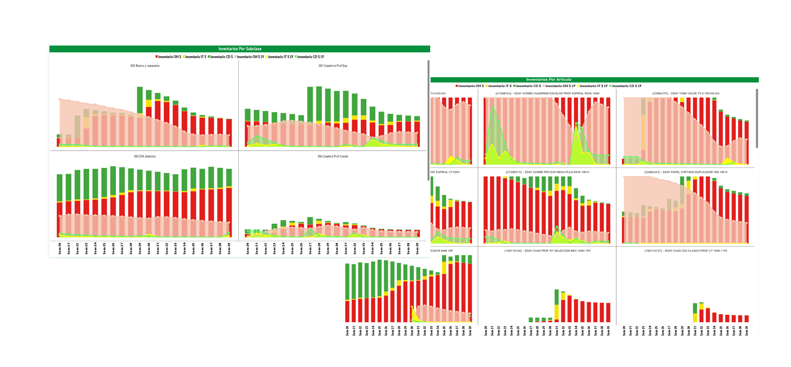

# pj_00-08 Dashboard de Desempeño Comercial y Gestión de Inventarios (Power BI)

## 1. Introducción

Se desarrolla un **dashboard en Power BI** para evaluar el desempeño de **más de 50 tiendas** retail, integrando métricas clave de **ventas, costos, utilidad, margen y volumen de productos**, con análisis comparativo **Year over Year (YoY)**. La solución combina indicadores financieros y operativos con el análisis del **inventario en tránsito, bodegas y tiendas**, permitiendo identificar variaciones relevantes, rotación de inventarios y posibles cuellos de botella dentro de la operación.

---

## 2.Objetivos

- Comparar métricas clave **Actual vs Año Anterior (YoY)**.
- Evaluar el comportamiento del inventario en distintas etapas de la cadena.
- Reducir la complejidad visual mediante el uso de **parámetros de campo**.

---

## 3. Desarrollo

Se plantea la **comparación simultánea del valor actual contra el año anterior en gráficos de barras**, manteniendo al mismo tiempo la **flexibilidad de visualizar distintas métricas dentro de una sola visualización**. Power BI no permite de forma nativa combinar comparativos YoY,  Múltiples métricas  en una única visual controladas por **Field Parameters**.

Se desarrollan dos **Medidas DAX con SWITCH + SELECTEDVALUE**  paralelas Para eleccionar dinámicamente la métrica a analizar.

```DAX

Actual =                                                                        
SWITCH(
    SELECTEDVALUE('5_Para_1_Productos'[Parámetro Orden]),
    0, [Ventas],
    1, [costos_venta_Actual],
    2, [Utilidad],
    3, [Margen_global],
    4, [Piezas_de_venta],
    BLANK()
)

SWITCH(
    SELECTEDVALUE('5_Para_1_Productos'[Parámetro Orden]),
    0, [Ventas_LY],
    1, [costos_venta_Actual],
    2, [Utilidad_LY],
    3, [Margen_global_LY],
    4, [Piezas_de_venta_LY],
    BLANK()
)


5_Para_1_Productos = {
    ("Ventas", NAMEOF('1_medidas_productos'[Ventas]), 0),
    ("Costos", NAMEOF('1_medidas_productos'[costos_venta_Actual]), 1),
    ("Utilidad", NAMEOF('1_medidas_productos'[Utilidad]), 2),
    ("Margen", NAMEOF('1_medidas_productos'[Margen_global]), 3),
    ("Piezas", NAMEOF('1_medidas_productos'[Piezas_de_venta]), 4)}
```

Se crean gráficos de barras con áreas sombreadas para visualizar y comparar el comportamiento Year over Year (YoY) de los distintos tipos de inventario. Las barras representan el inventario actual por categoría (On Hand, In Transit y Centros de Distribución), mientras que las áreas sombreadas corresponden al valor del año anterior, facilitando una comparación directa en una sola visualización. 

## 4. Resultados

El dashboard puede ser consultado en: [dashboard](https://app.powerbi.com/view?r=eyJrIjoiMjgxNjIwNTMtOGUyYS00ZjFiLTg2YzMtM2Y2ZTY0ZTU1MDBkIiwidCI6ImRmODY3OWNkLWE4MGUtNDVkOC05OWFjLWM4M2VkN2ZmOTVhMCJ9)

### 4.1 Métricas Clave


### 4.2 Inventarios



## 5. Conclusiones

Los resultados muestran una reducción del inventario en tienda y una mejor distribución del stock entre tránsito y centros de distribución, mejorando el capital de trabajo y la eficiencia operativa, con soporte en un análisis YoY claro y accionable para la toma de decisiones.
<hr>


